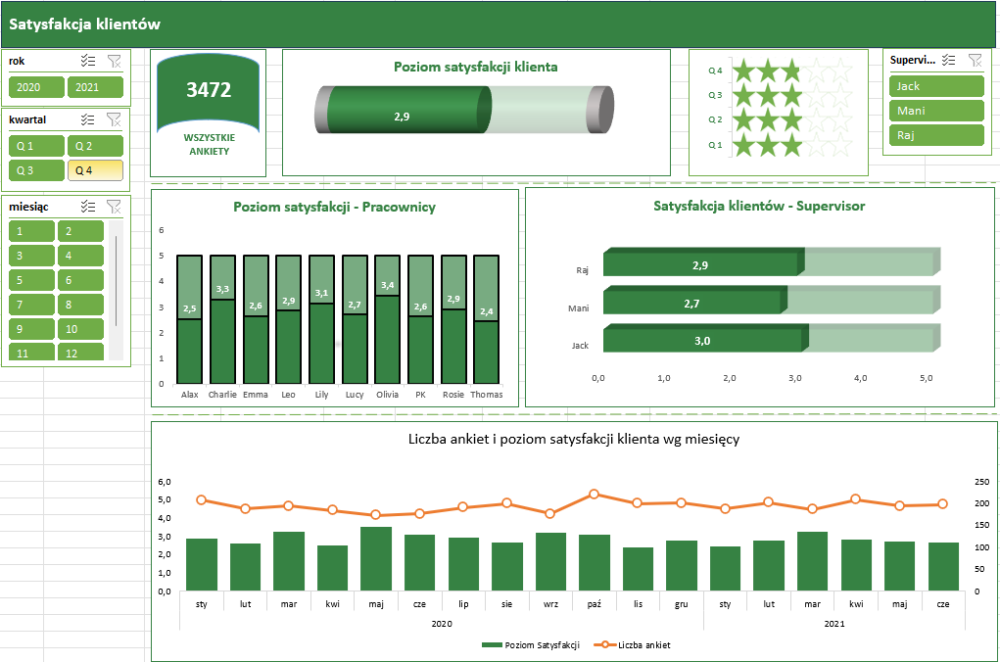

# Dashboard Satysfakcji Klientów

To repozytorium zawiera interaktywny Dashboard Satysfakcji Klientów stworzony za pomocą Power BI. Dashboard analizuje poziom satysfakcji klientów w różnych okresach i dostarcza wglądu w wyniki pracowników oraz supervisorów.

## Funkcje
- **Poziom Satysfakcji Klienta**: Wyświetla ogólny poziom satysfakcji klientów.
- **Satysfakcja Pracowników**: Pokazuje poziom satysfakcji dla poszczególnych pracowników.
- **Satysfakcja Supervisorów**: Przedstawia poziom satysfakcji dla różnych supervisorów.
- **Liczba Ankiet i Satysfakcja wg Miesięcy**: Wizualizuje liczbę ankiet i średni poziom satysfakcji wg miesięcy.
- **Interaktywne Filtry**: Umożliwia filtrowanie danych wg roku, kwartału, miesiąca oraz supervisora.

## Pliki
- `Satysfakcja Klientów Dashboard.pbix`: Plik Power BI zawierający dashboard.
- `SKDashboard.png`: Zrzut ekranu dashboardu.
- `SKDane.csv`: Zbiór danych używany do analizy (jeśli dotyczy).

## Jak korzystać
1. **Pobierz pliki**: Pobierz pliki `Satysfakcja Klientów Dashboard.pbix` oraz `SKDane.csv` (jeśli dotyczy) z repozytorium.
2. **Otwórz plik Power BI**: Otwórz `Satysfakcja Klientów Dashboard.pbix` w Power BI Desktop.
3. **Zaktualizuj źródło danych**:
   - Przejdź do `Strona główna` -> `Transformuj dane` -> `Ustawienia źródła danych`.
   - Wybierz źródło danych i kliknij `Zmień źródło`.
   - Przejdź do lokalizacji pobranego pliku `SKDane.csv` i wybierz go.
   - Kliknij `OK` oraz `Zamknij i zastosuj`.

## Zrzut ekranu

## Autor
Yauheni Bianko
