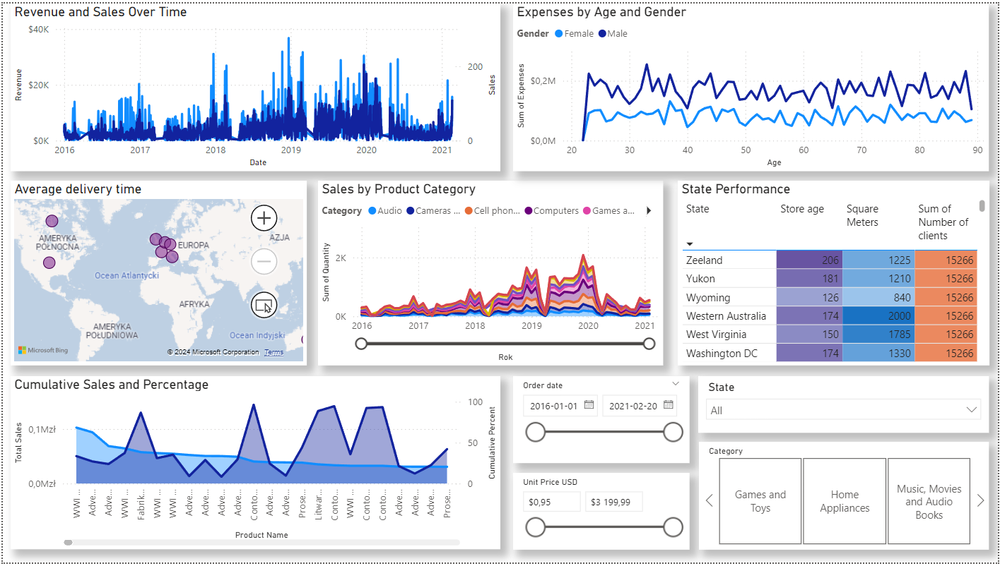

# Stores Performance Dashboard

This project is an interactive Stores Performance Dashboard created using Power BI. It analyzes sales data and provides insights into store performance, trends, and key metrics.

## Features
- **Revenue and Sales Over Time**: Displays total revenue and sales trends over time with interactive filtering by date.
- **Expenses by Age and Gender**: Shows the sum of expenses categorized by age and gender, highlighting spending patterns.
- **Average Delivery Time**: Geographic map showing average delivery times by region.
- **Sales by Product Category**: Breaks down sales quantity by product categories over time.
- **State Performance**: A table showing performance metrics like store age, square meters, and number of clients by state.
- **Cumulative Sales and Percentage**: Displays cumulative sales and their percentage contribution by product name.
- **Interactive Filters**: Date range, unit price, state, and category filters for dynamic data exploration.

## Files
- `Stores_Performance_Dashboard.pbix`: The Power BI file containing the dashboard.
- `Global Electronic Retailers.zip`: The dataset used for the analysis.
- `SPDScreenshot.png`: Screenshot of the KPI section of the dashboard.

## How to Use
1. **Download Files**: Download the `Stores_Performance_Dashboard.pbix` and `Global Electronic Retailers.zip` files from the repository.
2. **Extract ZIP File**: Extract the `Global Electronic Retailers.zip` file to a location on your computer.
3. **Open Power BI File**: Open `Stores_Performance_Dashboard.pbix` in Power BI Desktop.
4. **Import Data**:
   - Go to `Home` -> `Transform Data` -> `Data Source Settings`.
   - For each CSV file extracted from the ZIP:
     1. Click on `Change Source`.
     2. Navigate to the location of the extracted CSV file and select it.
     3. Click `OK`.
     4. Repeat the steps for each CSV file required by the Power BI dashboard.
   - After updating all data sources, click `Close & Apply`.
5. **Explore the Dashboard**: Once all data sources are updated, you can interact with and explore the dashboard to gain insights into store performance.

## Screenshot

## Author
Yauheni Bianko
