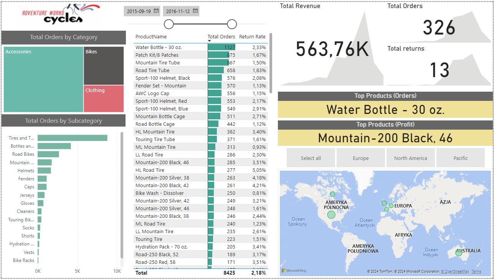

# Sales Performance Dashboard

This project is an interactive Sales Performance Dashboard created using Power BI. It analyzes sales data and provides insights into sales performance, trends, and key metrics.

## Features
- **Total Orders by Category**: Visual representation of total orders categorized by product types.
- **Total Orders by Subcategory**: Detailed view of orders broken down by subcategories.
- **Top Products**: Lists of top products by orders and return rate.
- **Geographic Analysis**: Map showing the number of orders for different countries.
- **Date Filter**: Allows users to filter the data by a specific date range.
- **Total Orders**: Shows the total number of orders placed within the selected date range.
- **Total Returns**: Indicates the total number of returned orders within the selected date range.
- **Top Product by Orders**: Identifies the product with the highest number of orders.
- **Top Product by Profit**: Highlights the product that generated the highest profit.

## Files
- `AWSalesAnalysis.pbix`: The Power BI file containing the dashboard.
- `AdventureWorks.zip`: The dataset used for the analysis.
- `AWScreenshot.png`: Screenshot of the dashboard.

## How to Use
1. **Download Files**: Download the `AWSalesAnalysis.pbix` and `AdventureWorks.zip` files from the repository.
2. **Extract ZIP File**: Extract the `AdventureWorks.zip` file to a location on your computer.
3. **Open Power BI File**: Open `AWSalesAnalysis.pbix` in Power BI Desktop.
4. **Update Data Source**:
   - Go to `Home` -> `Transform Data` -> `Data Source Settings`.
   - For each CSV file extracted from the ZIP:
     1. Click on `Change Source`.
     2. Navigate to the location of the extracted CSV file and select it.
     3. Click `OK`.
     4. Repeat the steps for each CSV file required by the Power BI dashboard.
   - After updating all data sources, click `Close & Apply`.
5. **Explore the Dashboard**: Once all data sources are updated, you can interact with and explore the dashboard to gain insights into store performance.
   
## Screenshot

## Author
Yauheni Bianko
