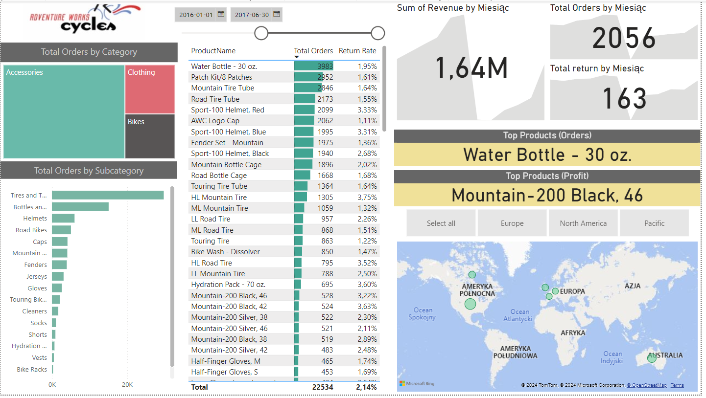

# Sales Performance Dashboard

This project is an interactive Sales Performance Dashboard created using Power BI. It analyzes sales data and provides insights into sales performance, trends, and key metrics.

## Features
- **Total Orders by Category**: Visual representation of total orders categorized by product types.
- **Total Orders by Subcategory**: Detailed view of orders broken down by subcategories.
- **Top Products**: Lists of top products by orders and return rate.
- **Geographic Analysis**: Map showing the number of orders for different countries.
- **Date Filter**: Allows users to filter the data by a specific date range.
- **Total Orders**: Shows the total number of orders placed within the selected date range.
- **Total Returns**: Indicates the total number of returned orders within the selected date range.
- **Top Product by Orders**: Identifies the product with the highest number of orders.
- **Top Product by Profit**: Highlights the product that generated the highest profit.

## Files
- `AWSalesAnalysis.pbix`: The Power BI file containing the dashboard.
- `AdventureWorks.zip`: The dataset used for the analysis.
- `AWScreenshot.png`: Screenshot of the dashboard.

## How to Use
1. **Download Files**: Download the `AWSalesAnalysis.pbix.pbix` and `AdventureWorks.zip` files from the repository.
2. **Open Power BI File**: Open `AWSalesAnalysis.pbix.pbix` in Power BI Desktop.
3. **Update Data Source**: If prompted, update the data source to point to the downloaded `AdventureWorks.zip` file:
   - Go to `Home` -> `Transform Data` -> `Data Source Settings`.
   - Select the `AdventureWorks.zip` source and click `Change Source`.
   - Navigate to the location of the downloaded `AdventureWorks.zip` file and select it.
   - Click `OK` and `Close & Apply`.

## Screenshot

## Author
Yauheni Bianko
